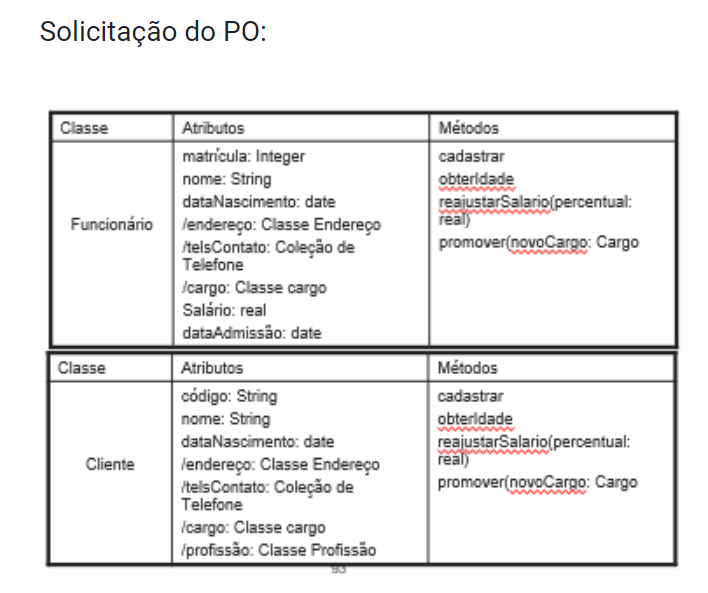

# Projeto TQF - Padrões de Projeto

Projeto da cadeira de **Padrões de Projeto** usando herança, polimorfismo e encapsulamento.

### Solicitação do PO

### Autores:

- João Vitor Pereira - @JANzxz;
- Danilo Pereira - @d4nkali.
